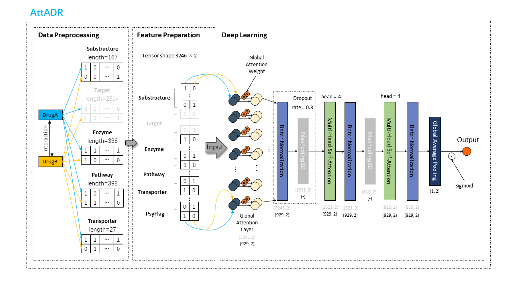

# AttADR
A ddi side-effect classfication tool using attention-based deep learning network.

<p align="center"></p>

## Quick Start

### Requirements
- Python 3.6+
- Tensoflow == 2.7.0

### Download AttADR
```shell
git-lfs clone https://github.com/Liuzhe30/AttADR
```

### Dataset Preparation
```shell
python3 pre_processing.py
```

## Contributing to the project
Any pull requests or issues are welcome.

## Progress
- [x] README for running attddi.