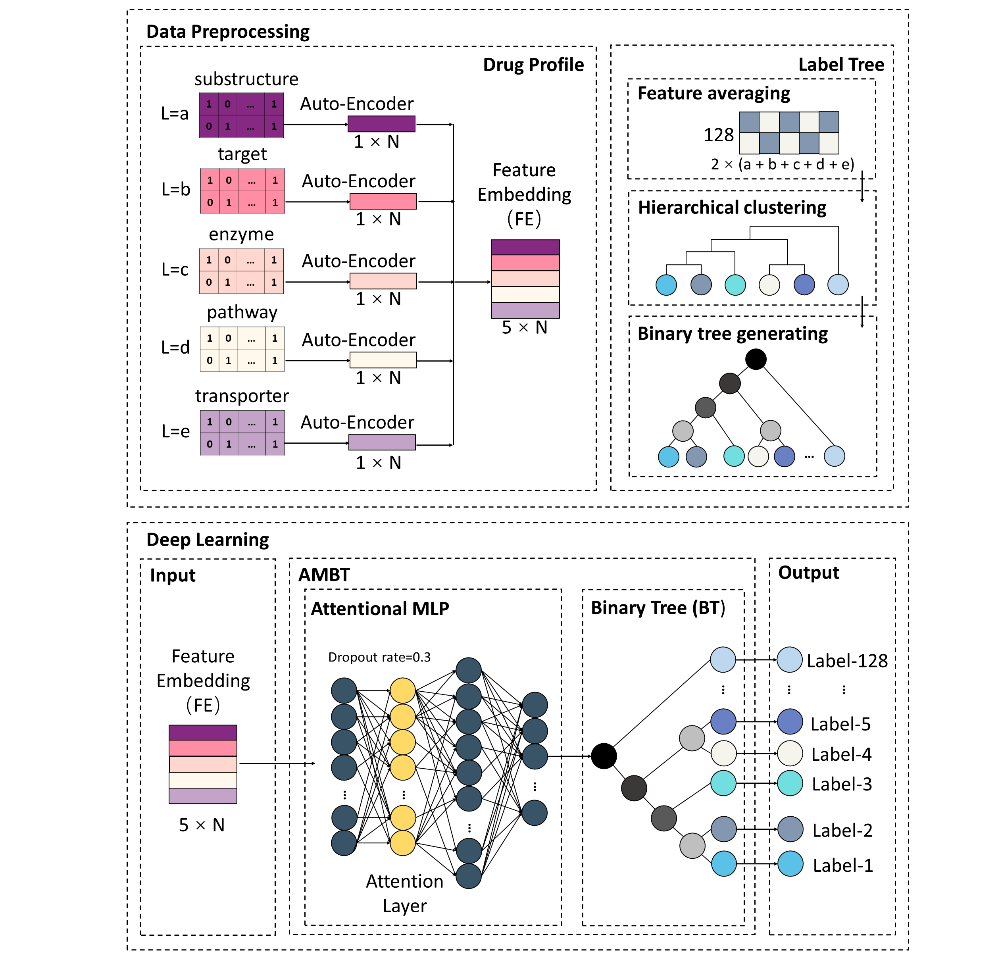

# ddiAMBT
A ddi classfication tool using attentional MLP-based binary tree.

<p align="center"></p>

## Quick Start

### Requirements
- Python 3.6+
- Keras == 2.2.4, Tensoflow == 1.14.0

### Download attddi
```shell
git-lfs clone https://github.com/Liuzhe30/ddiAMBT
```

### Dataset Preparation
```shell
python3 pre_processing.py
```

## Contributing to the project
Any pull requests or issues are welcome.

## Progress
- [x] README for running attddi.